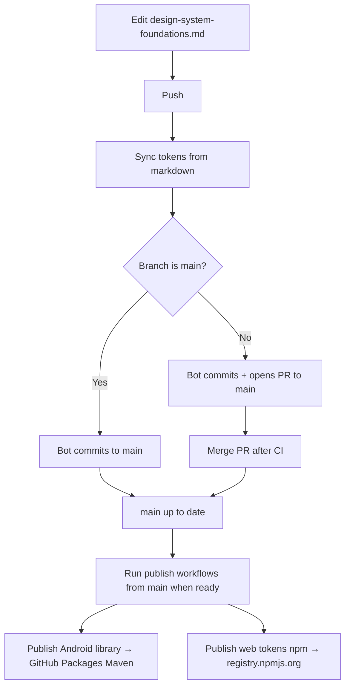

# Design System Tokens

Single source of truth for all design tokens. One `pnpm run build` generates platform-specific outputs for Web, Android, iOS, Flutter, and Compose Multiplatform.

## Quick Start

```bash
pnpm install

# Full pipeline: markdown → token JSONs → all platform outputs
pnpm run sync

# Or run each step separately:
pnpm run parse    # markdown → token JSONs only
pnpm run build    # token JSONs → platform outputs only
```

Outputs land in `dist/` (Gradle uses `./build/`, so token outputs use `dist/` to avoid clashes):

```
dist/
├── web/
│   ├── tokens.css          # CSS custom properties
│   └── tokens.js           # ES6 JavaScript constants
├── android/
│   ├── colors.xml          # Android color resources
│   ├── dimens.xml          # Android dimension resources
│   └── font_dimens.xml     # Android font dimensions
├── ios/
│   └── DesignTokens.swift  # Swift constants (UIColor)
├── flutter/
│   └── design_tokens.dart  # Dart constants (Color)
├── compose/
│   └── DesignTokens.kt     # Kotlin object (Compose Color/Dp)
└── json/
    └── tokens.json         # Flat JSON (debugging / other tools)
```

## How It Works

The pipeline has two stages:

**Stage 1 — `pnpm run parse`** runs `md-to-tokens.mjs`, which reads `design-system-foundations.md`, copies the `**Version:**` semver into `package.json`, extracts every JSON code block, converts to DTCG format (`$value` / `$type`), and writes each token category to its own file under `tokens/`.

**Stage 2 — `pnpm run build`** runs Style Dictionary, which reads all `tokens/**/*.json` files and generates platform-specific outputs in `dist/`.

**`pnpm run sync`** runs both stages in sequence — this is the single command the design team needs.

### Workflow

```
design-system-foundations.md    ← Designers edit this (the human-readable source)
         │
         ▼  pnpm run parse
    tokens/**/*.json            ← DTCG-format JSON (auto-generated)
         │
         ▼  pnpm run build
    dist/                       ← Platform outputs (auto-generated; commit with PR)
    ├── web/tokens.css
    ├── web/tokens.js
    ├── android/colors.xml
    ├── android/dimens.xml
    ├── ios/DesignTokens.swift
    ├── flutter/design_tokens.dart
    ├── compose/DesignTokens.kt
    └── json/tokens.json
```

### Versioning (releases)

Release numbers for **npm** (`@estebanruano/design-tokens`), **Android Maven** (`tokensVersion`), and the `version` field in `package.json` all come from the `**Version:** x.y.z` line at the top of `design-system-foundations.md`. **`pnpm run parse`** and **`pnpm run sync`** write that value into `package.json`; Gradle uses `package.json` when `-PtokensVersion` / `TOKENS_VERSION` are unset. Bump `**Version:**` for each release (npm and GitHub Packages reject duplicate versions).

**Further reading:** [General next steps (all platforms)](docs/general-next-steps.md) · [Android + Material 3](docs/android-material3-next-steps.md)

## Using tokens on the web

Web artifacts are **`dist/web/tokens.css`** (CSS custom properties on `:root`) and **`dist/web/tokens.js`** (named ES module exports, e.g. `ColorPrimary500`). **`dist/json/tokens.json`** is a flat JSON dump for scripts or design tooling.

### In this monorepo / locally

Point your app at the folder (or run `pnpm run sync` after token edits):

```bash
pnpm add "design-tokens@file:../design-system"
# or: npm install file:../path/to/design-system
```

Then import CSS once (global variables) and/or use JS constants:

```ts
import '@estebanruano/design-tokens/css';
import { ColorPrimary500, Spacing4 } from '@estebanruano/design-tokens';
```

```css
/* Bundlers that resolve package exports */
@import '@estebanruano/design-tokens/css';

.my-button {
  background: var(--color-primary-500);
  padding: var(--spacing-4);
}
```

### Published npm package (recommended for apps)

The package name is **`@estebanruano/design-tokens`**. The published version is the `**Version:**` line in `design-system-foundations.md` (copied into `package.json` when you run **`pnpm run sync`** before **Publish web tokens (npm)**). Install from the public npm registry:

```bash
pnpm add @estebanruano/design-tokens
# or: npm install @estebanruano/design-tokens
```

Use the same **`import '@estebanruano/design-tokens/css'`** and **`import { … } from '@estebanruano/design-tokens'`** paths; **`@estebanruano/design-tokens/json`** resolves to the flat **`tokens.json`** if you need it in Node or build scripts.

#### npm release checklist (maintainers)

1. Bump **`**Version:**`** in **`design-system-foundations.md`** (and merge so **`main`** has the release).
2. Run **`pnpm run sync`** locally or rely on CI / **Sync tokens from markdown** so **`package.json`**, **`tokens/`**, and **`dist/`** match the doc; commit any changes.
3. **First time only:** bootstrap the package with **`npm publish --access public`** from a machine logged into npm (see **[First publish on npm (bootstrap)](#first-publish-on-npm-bootstrap)**), then configure **Trusted publishing** on npm for workflow **`publish-web.yml`**.
4. **Ongoing:** GitHub → **Actions** → **Publish web tokens (npm)** → **Run workflow** on **`main`** (OIDC; no **`NPM_TOKEN`**).

### Fetching without a package manager (CDN)

After a version is on [npm](https://www.npmjs.com/), CDNs mirror tarballs, for example:

- `https://cdn.jsdelivr.net/npm/@estebanruano/design-tokens@x.y.z/dist/web/tokens.css`
- `https://cdn.jsdelivr.net/npm/@estebanruano/design-tokens@x.y.z/dist/web/tokens.js` (ES module; use `type="module"` in a script tag only if your page setup supports it)

Pin the version in the URL for reproducible builds. For production SPAs, prefer installing the package so your bundler fingerprints assets and you stay on supported import semantics.

## Token Structure

```
tokens/
├── color/
│   ├── primary.json        # Brand primary scale (00–800)
│   ├── secondary.json      # Brand secondary scale (00–800)
│   ├── neutral.json        # Gray scale (0–1000)
│   └── semantic.json       # Success, warning, error, info
├── typography/
│   └── scale.json          # Font families, weights, sizes, line heights
├── spacing/
│   └── spacing.json        # 4px base unit scale (0–40)
├── radius/
│   └── radius.json         # Border radii (none–full)
├── shadow/
│   └── shadow.json         # Elevation levels (sm–xl)
├── motion/
│   └── motion.json         # Duration + easing curves
└── opacity/
    └── opacity.json        # Disabled, hover, pressed, focus, scrim
```

## How to Update Tokens

### For engineers (Claude Code)
```bash
claude "Update primary-500 to #EA580C in tokens/color/primary.json, rebuild, commit and push"
```

### For designers (GitHub Web UI)
1. Generate updated JSON in Claude chat/Claude Design
2. Go to the file on GitHub → Edit → paste new content
3. Create branch + open PR → CI validates → reviewer merges

### For non-technical team (Cloud automation)
1. Save updated JSON file to shared OneDrive/Google Drive folder
2. n8n automation validates and opens a PR automatically

## Adding a New Token

1. Add the token to the appropriate JSON file under `tokens/`
2. Follow the DTCG-compatible format:
   ```json
   {
     "token-name": {
       "$value": "#F97316",
       "$type": "color",
       "$description": "Optional description"
     }
   }
   ```
3. Run `pnpm run sync` to verify all platforms generate correctly
4. Commit and push — CI validates; merge to `main`, then run **Publish Android library** and/or **Publish web tokens (npm)** manually when you want a Maven or npm release (see below)

## Automation (GitHub Actions)

This repo can run the full “edit markdown → tokens → PR → registries” loop on GitHub:

| Workflow | When | What it does |
|----------|------|----------------|
| **Sync tokens from markdown** | Push that changes `design-system-foundations.md` | Runs `pnpm run sync`, commits `tokens/`, `dist/`, and `package.json` (when changed) to the same branch, then opens a PR into `main` if the branch is not `main` and no open PR exists. On `main`, it pushes the sync commit directly. |
| **CI** | Pull requests to `main` | `pnpm run sync` then fails if anything drifts from the commit; builds `:design-tokens-android` with Gradle. |
| **Publish Android library** | Manual only: Actions → workflow → **Run workflow** (typically from `main`) | `pnpm run sync`, then `./gradlew :design-tokens-android:publish` to **GitHub Packages**. Maven **groupId**, **artifactId**, and Android **namespace** are set in **`gradle.properties`**. **Version** = `**Version:**` in `design-system-foundations.md` (via `package.json` after sync; override with `-PtokensVersion` / `TOKENS_VERSION` if needed). |
| **Publish web tokens (npm)** | Manual only: Actions → workflow → **Run workflow** (typically from `main`) | `pnpm run sync`, then **`npm publish`** (npm ≥ 11.5.1) to **registry.npmjs.org** using **[Trusted Publishing](https://docs.npmjs.com/trusted-publishers/)** (OIDC). Requires **`id-token: write`** in the workflow (already set) and a one-time **Trusted Publisher** config on npm for workflow file **`publish-web.yml`**. **Version** comes from the foundations markdown (see **Versioning** above). |

### Deployment workflow

Deployments are **manual** for Android (Maven) and web (npm). Nothing publishes automatically when you merge to `main`. Use this sequence when you want consumers to pick up a new release.

**Workflow files** (under `.github/workflows/`):

| File | Role |
|------|------|
| `sync-tokens-from-md.yml` | Regenerates artifacts after markdown edits (automatic on push). |
| `ci.yml` | Validates PRs: regenerated tree must match the commit. |
| `publish-android.yml` | Publishes the Android AAR to **GitHub Packages** (Maven). |
| `publish-web.yml` | Publishes **`@estebanruano/design-tokens`** to **npm** via **OIDC** ([Trusted publishing](https://docs.npmjs.com/trusted-publishers/)). |

**Recommended release path**

1. **Change tokens or version** in `design-system-foundations.md` (including `**Version:**` when you intend a new Maven/npm release — see **Versioning (releases)** above).
2. **Push** your branch. **Sync tokens from markdown** runs: it executes `pnpm run sync`, commits generated files, and either **opens a PR to `main`** (feature branches) or **pushes to `main`** (if you edited on `main` directly).
3. **Review and merge** the PR when CI is green (or confirm the direct push on `main` if you used that path).
4. **Publish** — only after `main` contains the version and artifacts you want live:
   - **Android:** GitHub → **Actions** → **Publish Android library** → **Run workflow**, select **`main`** (or a release branch if you use one). Uses `GITHUB_TOKEN`; no extra secret.
   - **Web:** GitHub → **Actions** → **Publish web tokens (npm)** → **Run workflow**, select **`main`**. Uses **OIDC trusted publishing** (no `NPM_TOKEN`); complete the [one-time npm setup](#npm-trusted-publishing-setup) below.

Both publish workflows run **`pnpm run sync`** first, so the published bits always match the checked-out commit (including `**Version:**` → `package.json`). The npm job then runs **`npm publish`** so the npm CLI can use OIDC (see [Trusted publishing](https://docs.npmjs.com/trusted-publishers/)).

**If publish fails with 409 / duplicate version**

The Maven or npm coordinate for that version already exists. Bump `**Version:**` in the foundations doc, merge a sync commit, then run the publish workflow again.



**Repo settings you need**

1. **Actions → General → Workflow permissions**: allow **Read and write** so the sync job can push commits and open PRs.
2. **Android publishing**: GitHub Packages Maven uses `GITHUB_TOKEN` from Actions (`packages: write` on the Android publish workflow). Bump `**Version:**` in `design-system-foundations.md` for every new Maven release — **the same version cannot be published twice** (Gradle will fail with **HTTP 409 Conflict** if you try).

#### npm: Trusted publishing setup

Web publishes use **[npm Trusted Publishing](https://docs.npmjs.com/trusted-publishers/)** from GitHub Actions (no long-lived **`NPM_TOKEN`**). Requirements from npm: **Node ≥ 22.14**, **npm CLI ≥ 11.5.1** (the workflow upgrades npm before publish).

##### First publish on npm (bootstrap)

The public registry has no **`@estebanruano/design-tokens`** until the first successful **`npm publish`**. Do this **before** opening Trusted publishing in the npm UI (that screen needs an existing package). Run as an npm user (or org) that is allowed to publish under the **`@estebanruano`** scope. Use **Node ≥ 18.12** for `pnpm`:

```bash
cd /path/to/design-system
nvm use 22                    # or another Node ≥ 18.12 (pnpm); ≥ 22.14 to match CI
pnpm install --frozen-lockfile
pnpm run sync
npm login                     # browser login, or use a granular publish token (see npm docs)
npm publish --access public   # creates the package; version = package.json (from **Version:** in the MD)
```

Check with **`npm view @estebanruano/design-tokens version`**. If publish fails with **403**, your npm user does not own the **`estebanruano`** scope — create an npm org or change **`package.json` → `name`** to a scope you control. If you see **404 Scope not found**, the **`@estebanruano`** scope does not exist on npm yet: create an organization named **`estebanruano`** at [npmjs.com/org/create](https://www.npmjs.com/org/create) (and add your user), **or** rename the package to a scope you already have (for example **`@<your-npm-username>/design-tokens`**) and update imports in apps + Trusted publishing after the first publish.

##### Connect GitHub Actions (Trusted publishing)

After the package exists on npm:

1. On **[npmjs.com](https://www.npmjs.com/)** → package **`@estebanruano/design-tokens`** → **Settings** → **Trusted publishing** → choose **GitHub Actions**.
2. Set the publisher so values match **exactly** (npm does not validate until publish):
   - **Repository:** `esteban505r/design-system` (or your fork’s `owner/name` — then set **`package.json` → `repository.url`** to that repo’s HTTPS URL, [required by npm](https://docs.npmjs.com/trusted-publishers/)).
   - **Workflow filename:** `publish-web.yml` (filename only, including `.yml`).
3. Run **Actions → Publish web tokens (npm)** on **`main`** to confirm OIDC works; then you can [revoke](https://docs.npmjs.com/revoking-access-tokens) any bootstrap publish token you no longer need.
4. Optional hardening: under package **Publishing access**, npm recommends restricting token-based publishes ([docs](https://docs.npmjs.com/trusted-publishers/)).

If **Publish web tokens (npm)** fails with **ENEEDAUTH** or trusted-publisher errors, re-check the workflow filename, repository name, and **`repository.url`** in **`package.json`** (`https://github.com/esteban505r/design-system.git` for this upstream repo).

**Android apps** add the GitHub Packages Maven URL and dependency (replace `OWNER/REPO`):

```kotlin
repositories {
    maven {
        url = uri("https://maven.pkg.github.com/OWNER/REPO")
        credentials {
            username = project.findProperty("gpr.user") as String? ?: System.getenv("GITHUB_ACTOR")
            password = project.findProperty("gpr.key") as String? ?: System.getenv("GITHUB_TOKEN")
        }
    }
}

dependencies {
    implementation("com.estebanruano:tokens-android:1.0.2")
}
```

Use the same **`mavenGroupId`**, **`mavenArtifactId`**, and release version (`**Version:**` / `package.json`) as in this design-system repo’s **`gradle.properties`** / **`design-system-foundations.md`** (e.g. `com.estebanruano:tokens-android`).

**Authenticate for GitHub Packages** (local machine): add to `~/.gradle/gradle.properties` (do not commit):

```properties
gpr.user=YOUR_GITHUB_USERNAME
gpr.key=YOUR_PAT_WITH_read:packages
```

In **CI** for the consuming app, inject the same values (e.g. repository secrets mapped to env vars or `ORG_GRADLE_PROJECT_gpr.*` so Gradle picks them up).

**Material 3 and multi-project structure:** see [docs/android-material3-next-steps.md](docs/android-material3-next-steps.md) for mapping tokens to M3 (Compose + Views), shared theme libraries vs apps, and flavors / multiple products.

### Using tokens in Android app code

The **`tokens-android`** artifact is a normal **`com.android.library`**: it ships **resource XML** only (colors, dimens, font dimens, etc.). After `implementation(...)`, those resources are **merged** into your app module, so you reference them like any other library resource.

**Resource names** match the generated files in this repo under **`dist/android/`** (e.g. `colors.xml`, `dimens.xml`). Typical names look like `color_primary_500`, `color_neutral_500`, `spacing_4`, `radius_md` — always confirm the exact `name="…"` in those files when you add or rename tokens.

**XML layouts**

```xml
<TextView
    android:layout_width="wrap_content"
    android:layout_height="wrap_content"
    android:textColor="@color/color_primary_500"
    android:padding="@dimen/spacing_4" />
```

**`styles.xml` / Material theme**

```xml
<style name="Theme.MyApp" parent="Theme.Material3.DayNight.NoActionBar">
    <item name="colorPrimary">@color/color_primary_500</item>
    <item name="colorOnPrimary">@color/color_neutral_0</item>
</style>
```

**Kotlin (Views, no Compose)** — use your **application module** `R` (it includes merged library resources):

```kotlin
import androidx.core.content.ContextCompat
import com.yourapp.R

val color = ContextCompat.getColor(context, R.color.color_primary_500)
view.setBackgroundColor(color)

val paddingPx = resources.getDimensionPixelSize(R.dimen.spacing_4)
```

**Jetpack Compose**

```kotlin
import androidx.compose.ui.res.colorResource
import androidx.compose.ui.res.dimensionResource
import com.yourapp.R

@Composable
fun BrandSurface() {
    Surface(color = colorResource(R.color.color_primary_500)) {
        // …
    }
}
```

`dimensionResource(R.dimen.…)` follows normal Android `dimen` semantics; check the AndroidX Compose docs for your BOM to see how values map to **`Dp`** in composables.

**`R` class / non-transitive R**

With **`android.nonTransitiveRClass=true`**, you still normally use **`com.yourapp.R`** in the **app** module for merged resources from dependencies. The library’s own namespace (`tokensAndroidNamespace` in `gradle.properties`) is mainly for the AAR’s internal `R` / manifest, not something you must import in app code unless you choose to.

**Name clashes**

If your app defines the same resource name (e.g. `color_primary_500`) in `res/values/`, the **app resource overrides** the library. To avoid collisions long-term, add a stable prefix in the token build (e.g. `ds_color_primary_500`) in Style Dictionary / naming convention.

Local Gradle in **this** repo copies `dist/android/*.xml` into `design-tokens-android` on each `preBuild` — run **`pnpm run sync`** before `./gradlew` if `dist/android` is missing.

## Adding a New Platform

Edit `sd.config.mjs` and add a new platform entry. See [Style Dictionary docs](https://styledictionary.com) for available formats and transform groups.

## Semver guidelines (token changes)

When you bump `**Version:**` in the foundations doc for a release, align the bump with the kind of token change (same ideas as [semver](https://semver.org/)):

- **Major** (2.0.0): Breaking change — token renamed or removed
- **Minor** (1.1.0): New tokens added
- **Patch** (1.0.1): Token value changed
