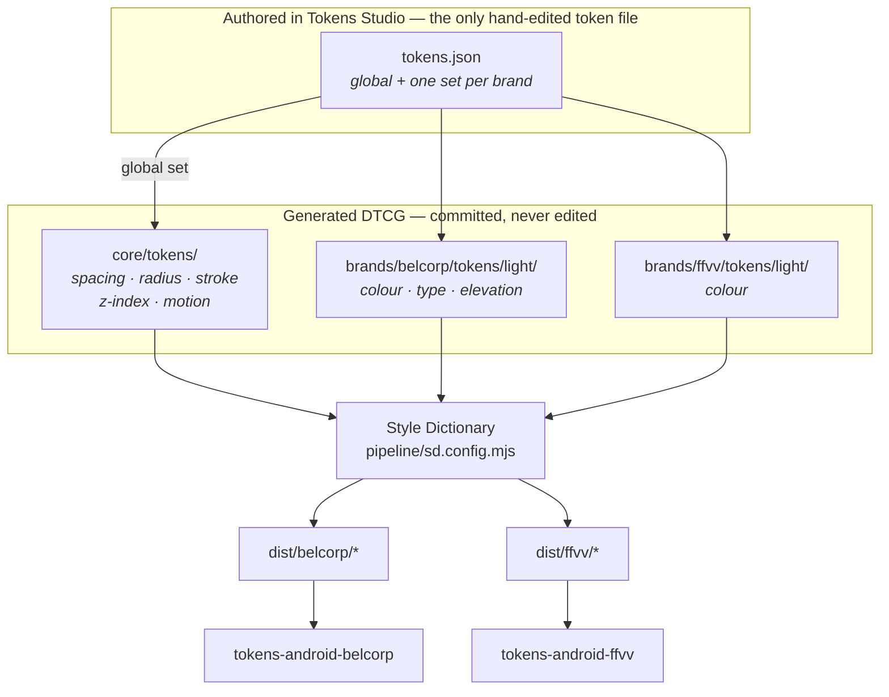

# Design System Tokens

A **design-token pipeline**, not a component library. Design authors token values
in Tokens Studio; this repo turns one `tokens.json` into artifacts for Android,
web, iOS and Flutter.


```mermaid
flowchart TD
    subgraph SSOT["Authored in Tokens Studio — the only hand-edited token file"]
        TJ["tokens.json<br/><i>global + one set per brand</i>"]
    end

    TJ -->|"global set"| CORE
    TJ --> TB
    TJ --> TF

    subgraph TREE["Generated DTCG — committed, never edited"]
        CORE["core/tokens/<br/><i>spacing · radius · stroke<br/>z-index · motion</i>"]
        TB["brands/belcorp/tokens/light/<br/><i>colour · type · elevation</i>"]
        TF["brands/ffvv/tokens/light/<br/><i>colour</i>"]
    end

    CORE --> SD
    TB --> SD
    TF --> SD
    SD["Style Dictionary<br/>pipeline/sd.config.mjs"]
    SD --> DB["dist/belcorp/*"]
    SD --> DF["dist/ffvv/*"]
    DB --> AB["tokens-android-belcorp"]
    DF --> AF["tokens-android-ffvv"]
```

One command drives all of it: **`pnpm run sync`**.

Geometry lives in `core/` because a rebrand changes colour and type, not the
spacing scale. Colour and type live per brand because that is exactly what a
brand *is*.

Five brands ship, each as its own AAR on GitHub Packages — the four Belcorp
multibrand identities (multibrand core + Ésika, L'Bel, Cyzone) plus FFVV:

| Brand | Artifact | Consumer |
|---|---|---|
| Belcorp (multibrand core) | `com.estebanruano:tokens-android-belcorp` | `app-consultoras-replatform-android` |
| Ésika | `com.estebanruano:tokens-android-esika` | — |
| L'Bel | `com.estebanruano:tokens-android-lbel` | — |
| Cyzone | `com.estebanruano:tokens-android-cyzone` | — |
| FFVV | `com.estebanruano:tokens-android-ffvv` | `ffvv-android-replatform` |

They share one pipeline, one `VERSION` and one set of role *names* — but not
values. That distinction is the whole design: see [Brands](docs/brands.md).

**Never edit `core/tokens/`, `brands/*/tokens/` or `dist/` by hand** — every one
of those files is regenerated from `tokens.json`, and CI fails the PR if what
you committed differs from what the pipeline produces.

## What an app may rely on

`core/vocabulary.mjs` is the contract: the semantic roles **every** brand
supplies, and therefore the only ones an application can safely bind to. Today
that is **16 roles**; 11 more are requested and evidenced in
[role-requests.md](docs/role-requests.md).

`pnpm test` enforces it in both directions — a brand dropping a role breaks the
build, and every brand gaining one prompts promotion. The floor only rises.

Bind to `color.text.primary`, not to `color.primary.500`. A primitive records
what colour something is; a role records what it is *for*, and only the second
survives a rebrand.

## Documentation

| Guide | Audience |
|-------|----------|
| **[Belcorp DESIGN.md](brands/belcorp/DESIGN.md)** · **[FFVV DESIGN.md](brands/ffvv/DESIGN.md)** | **Every token, with the exact identifier to type on each platform. Generated per brand — start here, never edit them.** |
| **[Brands](docs/brands.md)** | How brands, modes, `core/` and the vocabulary contract fit together; how to add a brand |
| **[Foundations & the semantic layer](docs/foundations-and-semantics.md)** | **Design team** — what design owns, why apps must bind to semantic roles rather than primitives, and what is still missing |
| **[Role requests](docs/role-requests.md)** | **Design + app teams** — how an app asks for a new semantic role, and the first batch measured from two apps |
| **[Consumers](docs/consumers.md)** | Who depends on this library, at what version, and how adoption is tracked |
| **[Figma SSOT](docs/figma-ssot.md)** | How a Figma export becomes platform artifacts |
| **[Releasing the Android library](docs/releasing-android.md)** | Shipping a new AAR — checklist, versioning, rollback |
| [Workflow & production](docs/workflow-and-production.md) | Repo settings, branch protection, registry setup |
| [General next steps](docs/general-next-steps.md) | Platform leads — adopting tokens across web, mobile, Flutter |
| [Android + Material 3](docs/android-material3-next-steps.md) | Android / Compose — theme mapping |

## Quick start

```bash
pnpm install
pnpm run sync     # expand tokens.json, then build every platform
pnpm test
```

| Command | Does |
|---------|------|
| **`pnpm run sync`** | `parse` + `build` for every brand. This is the one you want. |
| `pnpm run parse` | `tokens.json` → the token tree, per brand |
| `pnpm run build` | token tree → `dist/<brand>/**` and `brands/<brand>/DESIGN.md` |
| `pnpm run figma:verify` | Regenerate the Figma export from the token tree and diff it against the SSOT |
| `pnpm test` | Round-trip, name-map, core-ownership, vocabulary-contract and generated-output guards |

Every command acts on all brands. Add `--brand <id>` to narrow:
`node pipeline/sd.config.mjs --brand belcorp`.

## Repository layout

```
tokens.json               Tokens Studio source of truth (one file, every brand)
core/tokens/              scales shared by every brand: spacing, radius, stroke,
                          z-index, motion
brands/<id>/
  brand.json              identity, Maven/npm coordinates, declared modes
  figma/tokens.json       generated flat export of this brand
  tokens/light/           generated DTCG: colour, typography, elevation
  DESIGN.md               generated token catalogue
pipeline/                 the generator, shared by every brand
platforms/android/<id>/   one Gradle module per brand (one line each)
buildSrc/                 the convention plugin all brand modules apply
dist/<id>/<platform>/     built artifacts (committed)
test/                     the guards CI runs
```

See **[docs/brands.md](docs/brands.md)** for how values resolve across
`core/` → brand → mode, and what it takes to add a brand.

## Versioning

One **`VERSION`** file at the repo root, shared by every brand — a brand-only
change bumps them all, which is cheap, where per-brand versions would multiply
the release matrix.

```bash
pnpm run version:set -- --version 3.1.0   # writes VERSION and mirrors it into package.json
pnpm run sync
```

Gradle reads `VERSION` when `-PtokensVersion` / `TOKENS_VERSION` are unset.
Bump for each release — GitHub Packages and npm both reject duplicate versions.

| Bump | Meaning |
|---|---|
| **Major** | A token was renamed or removed |
| **Minor** | New tokens added |
| **Patch** | A token value changed |

## Changing a token

1. Change the token in **Tokens Studio** and push `tokens.json`.
   Storage location is the **file** `tokens.json`, not a folder.
   Put shared scales in the `global` set and brand colour, type, and elevation
   in that brand's set (`belcorp`, `esika`, `lbel`, `cyzone`, `ffvv`).
2. `pnpm run sync && pnpm test`.
3. Commit `tokens.json` *and* the regenerated tree and `dist/`. CI re-runs the
   sync and fails on any drift.

Pushing `tokens.json` also triggers the **Sync tokens from Figma JSON**
workflow, which does steps 2–3 and opens a PR.

A new token inside an existing group needs no name map. The flat per-brand
export (`brands/<brand>/figma/tokens.json`) is generated, and a name that
cannot be flattened still has to be added to `FIGMA_TO_TOKEN_PATH`.

## Using the tokens

### Android

Add the GitHub Packages repository and the artifact:

```kotlin
repositories {
    maven {
        url = uri("https://maven.pkg.github.com/esteban505r/design-system")
        credentials {
            username = project.findProperty("gpr.user") as String? ?: System.getenv("GITHUB_ACTOR")
            password = project.findProperty("gpr.key") as String? ?: System.getenv("GITHUB_TOKEN")
        }
    }
}

dependencies {
    // One brand per app. `api` from exactly one module if other modules need it —
    // that is what keeps the wiring to three files instead of one per feature.
    implementation("com.estebanruano:tokens-android-belcorp:3.0.0")
    // or: com.estebanruano:tokens-android-ffvv
}
```

The artifact id and version come from `brands/<brand>/brand.json` and `VERSION`.
Both brands are published from the same `VERSION`, so an app never has to
reason about which brand is on which release.
Authenticate locally by adding to `~/.gradle/gradle.properties` (never commit it):

```properties
gpr.user=YOUR_GITHUB_USERNAME
gpr.key=YOUR_PAT_WITH_read:packages
```

The AAR ships **resource XML plus a Compose object**. Resources merge into your
app module, so you reference them like any other library resource. Names match
the generated files in `dist/belcorp/android/`: `colors.xml`, `dimens.xml`
(spacing, radius **and font sizes in `sp`**), `integers.xml`, `strings.xml`.
There is no `R.font_dimens` type — font sizes are normal `R.dimen` entries.

**Colours are bare; every non-colour resource is prefixed `bds_`.** Of the 317
resource names in the AAR, the 240 `color_*` are unprefixed and the other 77 —
54 `@dimen`, 14 `@integer`, 9 `@string` — all carry the prefix. Library
resources merge into the consuming app's namespace, and on a name clash the
application module silently wins: no warning, no build failure, just a wrong
value at runtime. (`android.nonTransitiveRClass` changes R-class generation, not
the merge.) Generic names like `spacing_4` are the ones an app would plausibly
reinvent, so they are namespaced; `color_*` names are specific enough that
nobody reinvents them, and they are already referenced throughout the existing
consumer's layouts, so renaming them would be a large migration for no
measurable benefit. **Compose is unaffected** — the `DesignTokens` object and
its package already namespace those names.

**XML**

```xml
<TextView
    android:textColor="@color/color_primary_500"
    android:textSize="@dimen/bds_font_size_h1"
    android:padding="@dimen/bds_spacing_4" />
```

**Compose** — the generated `DesignTokens` object is typed (`Color`, `Dp`, `TextUnit`),
so it needs no `LocalDensity` dance:

```kotlin
import com.estebanruano.designtokens.DesignTokens

Text(
    text = "Hola",
    color = DesignTokens.colorPrimary500,
    fontSize = DesignTokens.fontSizeH1,
)
```

Compose artifacts are `compileOnly` in the token module, so the AAR never forces
a Compose version on you — your app's own Compose dependency is used.

If you prefer resources in Compose, `colorResource(R.color.color_primary_500)`
and `dimensionResource(R.dimen.bds_spacing_4)` work as usual. Note
`dimensionResource` returns `Dp`, so a font size needs
`with(LocalDensity.current) { dimensionResource(R.dimen.bds_font_size_h1).toSp() }`.

**Name clashes:** if your app defines the same resource name in its own
`res/values/`, the app resource wins. The `bds_` prefix closes that hole for
every non-colour resource; `color_*` stays exposed, so do not redeclare a
`color_*` name in your app.

### Web

Generated into `dist/<brand>/web/`:

| File | What |
|---|---|
| `tokens.css` | CSS custom properties on `:root` |
| `tokens.js` | Named ES module exports |
| `../json/tokens.json` | Flat Style Dictionary dump for scripts |
| `../figma/tokens.json` | Copy of the SSOT, for Figma/Tokens Studio import |

```css
.my-button {
  background: var(--color-primary-500);
  padding: var(--spacing-4);
}
```

> **Not published to npm yet.** `package.json` is `private: true`, and the
> package name and subpath exports are still brand-specific rather than the
> `@scope/tokens/<brand>/css` shape that multi-brand consumption wants.
> Consume `dist/<brand>/web/` from the repo until that lands.

### iOS and Flutter

`dist/<brand>/ios/DesignTokens.swift` and
`dist/<brand>/flutter/design_tokens.dart` are generated and **compile-checked in
CI** (`swiftc -typecheck`, `flutter analyze`). They are not packaged for SPM or
pub yet — publishing creates a support obligation, and no consumer has imported
them. Copy the file, or vendor the directory, in the meantime.

## Automation

| Workflow | When | What it does |
|----------|------|--------------|
| **Sync tokens from Figma JSON** | Push to `brands/*/figma/tokens.json`, or manual | `pnpm run sync` → commit → open a PR |
| **CI** | PR to `main` / `belcorp` | sync → `pnpm test` → fail on drift → assemble every brand's AAR; type-check the generated Swift and Dart |
| **Publish Android library** | Manual | sync → validate every brand's dist → Gradle `publish` |
| **Publish web tokens (npm)** | Manual | sync → `npm publish` (blocked while `private: true`) |

Merging does **not** publish. Run a publish workflow when consumers need a new
version.

## Adding a platform

Add an entry to the `platforms` map in `pipeline/sd.config.mjs`. Note the warning
at the top of that file: token values are **px**, and every built-in Style
Dictionary size transform treats them as **rem** and multiplies by 16. Use the
`android/px`, `compose/typed`, `ios/px` and `flutter/px` groups defined there,
never the stock `android` / `compose` / `ios-swift` / `flutter` groups.
