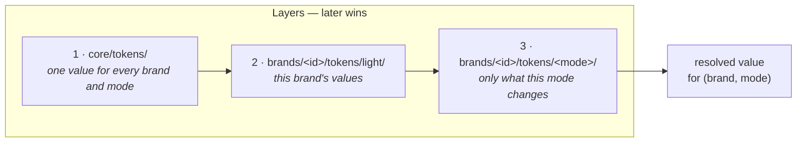
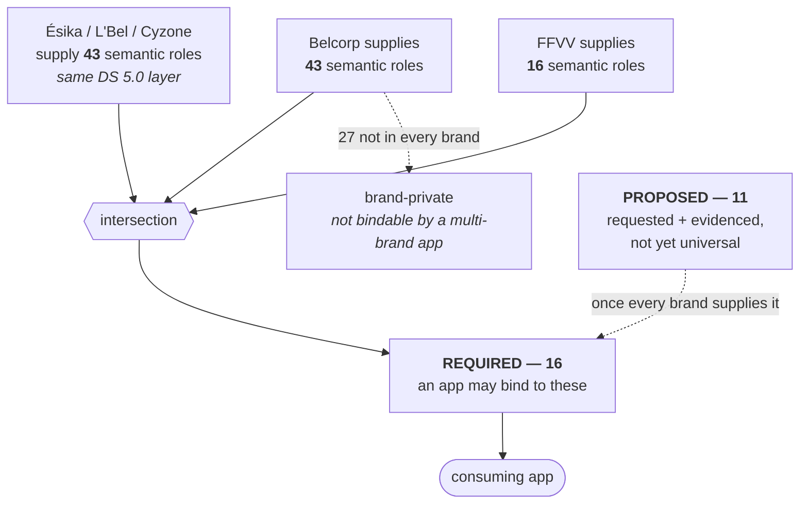

# Brands

This repository is **one mainline with brands as configuration**. Brands used to
be separate git branches, which meant every pipeline fix had to be applied twice
and the two branches drifted apart. They are now directories.

## The brands

| Brand | Owns `core/` | Colour tokens | Typeface (DS 5.0) | Consumer |
|---|---|---|---|---|
| `belcorp` | ✅ | 240 | Montserrat (multibrand core) | `app-consultoras-replatform-android` |
| `esika` | — | 43 | Sweet Sans Pro → **Work Sans** (placeholder) | — |
| `lbel` | — | 43 | Brown Pro → **DM Sans** (placeholder) | — |
| `cyzone` | — | 43 | Lasiver → **Red Hat Text** (placeholder) | — |
| `ffvv` | — | 83 | — | `ffvv-android-replatform` |

`esika`, `lbel` and `cyzone` are the **sub-brands of Fractal DS 5.0** (the same
Belcorp multibrand file). DS 5.0 verifies exactly one colour per sub-brand —
their primary — and one typeface. Everything else in their sets is the shared
multibrand core: the neutral/text/border/status values and the type scale are
identical to `belcorp`; only the brand-colour roles (`bg-brand`, `text-brand`,
`border-brand`, `interactive-primary-*`, `bg-brand-subtle`) and the font family
differ. Hover/active/focus/brand-subtle tints are **derived** from the verified
primary by mixing toward black/white, mirroring where the multibrand ramp steps
sit — they are placeholders to be replaced when official per-brand palettes land.

FFVV is the reason the multi-brand model earns its keep. It was assumed to be a
second *consumer* of Belcorp's tokens; measuring it showed otherwise. Of its 82
colours, **exactly one** (`#A90061`, Cyzone's brand red) matches a Belcorp token
in both value and meaning. Its primary is `#7D4DBE` — the purple Belcorp shipped
before v3.0.0 rebranded to orange `#BE5B06`.

Pointing FFVV at Belcorp's tokens would therefore not have swapped a primitive
layer; it would have repainted the app, across 283 call sites of
`Sem.ActionPrimary` alone. It is a brand, not a consumer, and modelling it as
one is what makes its integration a no-op.

The same measurement caught a smaller divergence worth fixing: FFVV renders
Ésika at `#E22419`, Belcorp at `#E1251B`. One company, one brand, two values.

## Layout

```
core/tokens/                    scales shared by every brand: spacing, radius,
                                stroke, z-index, motion
brands/<id>/
  brand.json                    identity, coordinates, declared modes
  figma/tokens.json             this brand's source of truth (Tokens Studio export)
  tokens/light/                 generated DTCG: colour, typography, elevation
  DESIGN.md                     generated catalogue for this brand
pipeline/                       the generator, shared by all brands
platforms/android/<id>/         one Gradle module per brand (one line each)
buildSrc/                       the convention plugin those one-liners apply
dist/<id>/<platform>/           built artifacts
```

A brand's Android module is literally `plugins { id("design-tokens-brand-module") }`. All the
real build logic — namespace, the `dist/` copy tasks, publishing — lives once in
`buildSrc/src/main/kotlin/design-tokens-brand-module.gradle.kts`, and the brand id is the
module's directory name, so there is no property to pass or forget to update.

## How a token's value is resolved

A token's **identity** is its path (`color.bg.brand`). Its **value** is a
function of (brand, mode). Layers, later wins:



1. `core/tokens/` — one value for every brand and mode
2. `brands/<id>/tokens/light/` — the brand's own values
3. `brands/<id>/tokens/<mode>/` — only what that mode changes

The identity never varies. `color.text.primary` means the same thing in every
brand and every mode; only the hex behind it moves. That is what lets one app
binding serve N brands — and what makes a *primitive* binding
(`color.primary.500`) a bug rather than a style preference.

`light` sits beneath every other mode, so a dark file carries only the tokens
that actually differ rather than restating the whole set.

Only `light` is built today. `pipeline/brands.mjs` already layers any mode, but
every platform writes one flat file per artifact, so a second mode would
overwrite the first instead of landing in `values-night/` or a dark
`ColorScheme`. Emitting those is spec-generator work.

## Who owns `core/`

Exactly one brand carries `"ownsCore": true`; its Figma export is what writes
`core/tokens/`. Any other brand whose export disagrees with `core/` **fails the
build**, naming the files that differ.

That guard is not hypothetical. Belcorp's `core/` holds 43 tokens; the Oter token set still
on the `main` branch defines 23 in the same categories, and of the **ten paths the two sets
share it disagrees on four**:

| Token | Oter | Belcorp |
|---|---|---|
| `radius.sm` | 6 | 4 |
| `motion.duration.fast` | 150 | 100 |
| `z-index.modal` | 1050 | 200 |
| `z-index.toast` | 1060 | 300 |

Last-writer-wins would have made the built output depend on the order brands
happen to be processed in. Failing is the only honest option — the disagreement
is a design decision, not something a build can resolve.

FFVV sets `ownsCore: false` and never trips the guard, because it supplies no
core-category tokens at all. Its `Dimentions.kt` was ~100 named literals —
`dp_0`, `dp_117`, `dp_389`, `dp_991` — which is a lookup table, not a scale.
There was nothing to reconcile, so it simply inherits `core/`.

## The vocabulary contract

`core/vocabulary.mjs` declares which semantic roles an application may bind to.
A role earns `REQUIRED` status only when **every** brand supplies a value — that
is what makes it safe to depend on.



`test/vocabulary.test.mjs` asserts `REQUIRED` **equals** that intersection, so
neither side can drift: a brand losing a role fails the build, and every brand
gaining one fails it too — with "promote this". There is no state in which the
declared contract and the shipped tokens disagree, and the floor can only rise.

Today that floor is **16 roles**. Belcorp supplies 43, FFVV 16 — so 27 of
Belcorp's are not yet bindable by a multi-brand app. `PROPOSED` holds the 11
roles both consumers have asked for, evidenced in
[role-requests.md](role-requests.md).

### Extensions: the `x.<brand>.` namespace

A value a brand needs that the shared vocabulary cannot name goes under
`x.<brand>.*`, declared in its `brand.json` with an owner and a review date.
Two properties make this safe rather than a second escape hatch:

- The prefix is visible at every call site, so `x.ffvv.surface-third` can never
  be mistaken for a shared role.
- The count is a metric. FFVV has **65** extensions against 18 shared roles;
  that ratio *is* the size of the vocabulary gap, and it should only shrink.

## Adding a brand

1. `brands/<id>/brand.json` — start from `brands/belcorp/brand.json`. Leave
   `ownsCore` unset unless this brand is replacing the one that owns core.
2. `brands/<id>/figma/tokens.json` — the Tokens Studio export.
3. Map any new Figma names in `pipeline/token-name-map.mjs`. Unmapped names are
   a hard error, so nothing can silently vanish.
4. `platforms/android/<id>/` — copy Belcorp's directory. Its `build.gradle.kts`
   is one line; `settings.gradle.kts` discovers the rest.
5. `pnpm run sync && pnpm test`.

Nothing in `pipeline/` should need editing. If it does, that is the signal that
something brand-specific has leaked into shared code.

### Namespaces are per brand

`androidNamespace` and `composePackage` in `brand.json` must be unique — two
AARs sharing an R-class namespace produce duplicate `R` classes, and two
`DesignTokens` objects in one package collide. Belcorp pins the values already
published (`com.estebanruano.tokens`, `com.estebanruano.designtokens`); changing
them breaks every consumer, so new brands take the defaults instead.

## Versioning

One `VERSION` for all brands. A brand-only change bumps everyone, which is
cheap; per-brand versions would multiply the release matrix by N for no real
benefit.
