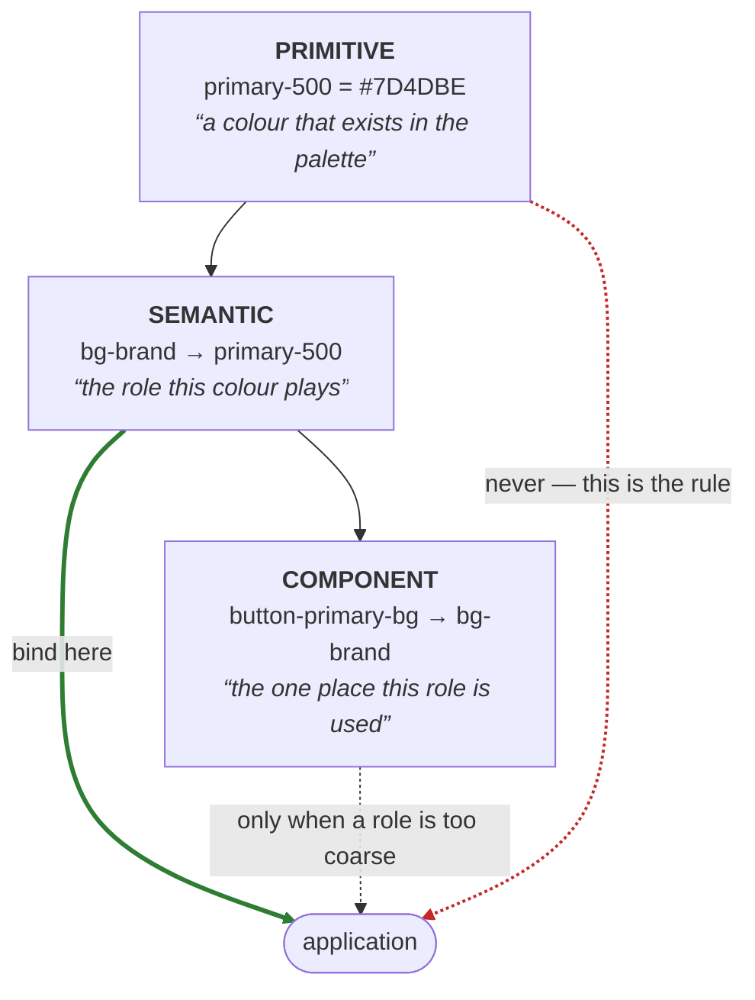

# Foundations and the semantic layer — what design owns

**Audience:** the design team, plus anyone deciding what belongs in this repo.

The short version: **applications must bind to semantic tokens, not to colour values or
palette positions.** That only works if the design team authors a semantic vocabulary
complete enough to describe every surface an app renders. Today it is not, and this
document says what is missing and why it matters.

**Related**

| Document | Purpose |
|----------|---------|
| [DESIGN.md](../brands/belcorp/DESIGN.md) | Every token as it exists right now (generated) |
| [role-requests.md](role-requests.md) | The first batch of requested roles, and how to request more |
| [figma-ssot.md](figma-ssot.md) | How `brands/belcorp/figma/tokens.json` becomes platform artifacts |
| [brands.md](brands.md) | The multi-brand model — brands, modes and `core/` |
| [releasing-android.md](releasing-android.md) | Shipping a change to an application |
| [design-system-foundations.md](../design-system-foundations.md) | The rules and release policy |

---

## 1. The three tiers

| Tier | Owner | Apps may reference |
|---|---|---|
| Primitive | Design | **No** — for the semantic layer, showcases and documented exceptions |
| **Semantic** | **Design** | **Yes — this is the contract** |
| Component | Design (optional) | Yes, when a role is too coarse for one component |

The distinction that matters: **a primitive answers "what colour is it", a semantic token
answers "what is it for".** Only the second survives a rebrand.

## 2. Why applications must not bind to primitives

Suppose an app writes `colorPrimary500` wherever it needs the brand colour. Rebranding
then changes every one of those places — including the ones that were only *coincidentally*
that colour. There is no way to tell, from the token name, which usages meant "the brand"
and which meant "that particular shade". The value is centralised; the intent is not.

This is not a thought experiment here. v3.0.0 moved the primary ramp from purple to
orange, and because the app binds to `colorPrimary500`, the change could not be reviewed
by looking at the token — every call site had to be checked by hand.

Now suppose the app writes `bgBrand`. Design changes what `bg-brand` points to and every
usage is correct by construction, because each one declared its intent at the call site.

**This is the entire reason to run a design system across several applications.** Shared
primitives give you a shared palette. Only shared *semantics* give you a shared rebrand,
a shared dark mode, and a shared accessibility fix.

## 3. Who owns what

| Layer | Owner | Responsibility |
|---|---|---|
| Primitives | **Design** | The palette. Values, ramps, how many steps. |
| **Semantics** | **Design** | The vocabulary of roles, and what each maps to. |
| Component tokens | **Design** (optional) | Per-component overrides where a role is too coarse. |
| Binding UI to semantics | Engineering | Every component reads a semantic token, never a primitive. |
| `color.app.*` | Nobody — it is debt | Values absorbed from app code during migration. To be drained. |

The split to hold onto: **design decides what the roles are; engineering decides which role
a given piece of UI plays.** Neither can do the other's half. Engineering cannot invent
`bg-elevated` and have it mean anything; design cannot know that a particular card in the
checkout flow is an elevated surface.

## 4. Where we actually are

Counted from `brands/belcorp/figma/tokens.json` at the time of writing:

| Tier | Colour tokens |
|---|---:|
| `color.app.*` — absorbed one-offs | **118** |
| Primitive ramps | 75 |
| **Semantic** (`text`, `bg`, `border`, `interactive`, `status`) | **43** |
| Brand (Belcorp, Ésika, Cyzone, L'Bel) | 4 |

Two things follow from those numbers.

**The escape hatch is nearly three times the vocabulary.** `color.app.*` exists because the
Android migration absorbed every colour the app already used, at its exact value, so the
migration could be proven to change nothing visually. That was the right call for a
migration and is the wrong shape for a design system. Each of those 118 is a surface whose
*role* nobody has named.

**Some of them are not even new roles.** `app-border-subtle` (`#00000011`) sits in the escape
hatch under the exact name the semantic layer would give it: the `border` family has `brand`,
`default`, `disabled` and `strong`, and no `subtle`. Promoting it is a **move, not an
addition** — the role was already named, it was just filed one tier too low. That makes it the
cheapest retirement available, and it is this section's argument in a single token: the
distance between 118 and 43 is not 118 new design decisions.

**The Android app binds to primitives, not to the 43.** It reads `colorNeutral0` and
`colorPrimary500`. So the app is fully tokenised — no hardcoded colour survives — but a
rebrand still requires reviewing usages by hand, because the intent was never recorded.
That is the single largest gap between where the system is and what it promises.

Existing semantic families, for reference: `bg` (11), `status` (12), `text` (10),
`interactive` (6), `border` (4).

## 5. What the design team needs to produce

In rough priority order. This section states the shape of the work in the abstract;
**[role-requests.md](role-requests.md) is where it is operationalised** — it carries the
concrete first batch of proposed role names, each derived from measured demand in two
consumer applications, plus the process and the promotion filter for requesting more.

**5.1 Complete the vocabulary.** The current 43 cover a flat page: one background, one
surface, default borders. Real screens need more. The gaps visible from the app's one-offs:

- **Surface hierarchy** — page vs card vs sheet vs elevated vs overlaid. Many of the 118
  are "a slightly different white or grey", which is a hierarchy nobody has named.
- **Interactive states beyond primary** — secondary and tertiary actions, destructive
  actions, and the hover/pressed/disabled/focus set for each.
- **On-colour text roles** — what text is legible on a brand surface, a status surface, an
  image. This is where contrast obligations live.
- **Feature/domain colours** — the Camino Brillante level palette is a real, permanent
  design domain. It deserves proper naming, not the `color.app.*` bucket. This is bigger
  than it looks: the SSOT already holds **24 `app-camino-*` entries** — `ambar`,
  `ambar-deep`, `brillante`, `brillante-deep`, `club-card-bg`, `club-card-gold`,
  `club-card-highlight`, `consultora`, `consultora-deep`, `coral`, `coral-deep`, `cristal`,
  `cristal-light`, `diamante`, `diamante-light`, `first-level`, `gran-brillante`,
  `gran-brillante-light`, `jade`, `perla-deep`, `rubi`, `rubi-light`, `topacio`,
  `topacio-deep`. The second consumer (FFVV) models only six corresponding members, so its
  set is a *subset* — a canonical `camino.*` has to be derived from the 24, not from FFVV.
  Worse, `app-camino-diamante` collides with FFVV's `DiamondBG`, which would otherwise be
  filed under a separate consultant-tier namespace. "Camino Brillante" and the tier ladder
  may therefore be one concept under two programme names. **Reconcile the two before either
  namespace is authored** — author both and the duplication is baked in permanently, to be
  kept in sync by hand forever. See [role-requests.md](role-requests.md).

**5.2 Raise the shared vocabulary.** ~~Decide the multi-brand model~~ — settled, and now
real. Brands are **values over one set of shared role names**, not separate token sets. Two
ship today: `belcorp` and `ffvv`, each a directory under `brands/`; `core/` holds the
geometry both agree on. See [brands.md](brands.md).

The contract is executable: `core/vocabulary.mjs` lists the roles **every** brand supplies,
and `pnpm test` fails if a brand drops one. That is what an application may bind to.

**The number that matters is 16.** Belcorp supplies 43 semantic roles; FFVV supplies 16. The
contract is the intersection, so a multi-brand app can rely on 16 — the other 27 of Belcorp's
are, from the shared-vocabulary point of view, still brand-private.

FFVV is the proof this shape was right rather than merely tidy. It was assumed to be a second
consumer of Belcorp's tokens; measured by hex, **1 of its 82 colours** matched in both value
and meaning, because it still runs the purple that v3.0.0 replaced. As a *consumer* it would
have been repainted. As a *brand* it was a no-op.

It also shows where the vocabulary is thin: of FFVV's 83 roles only 18 landed on shared names.
The other 65 sit under `x.ffvv.*`, and that ratio is the gap. Ésika, Cyzone and L'Bel can
become brands whenever design wants — the machinery is done — but each will land the same way
until the roles in §5.1 exist for them to supply values *for*.

**5.3 Name roles, not values.** A semantic token whose name describes appearance has not
actually moved up a tier:

| Prefer | Avoid | Why |
|---|---|---|
| `bg-elevated` | `bg-white` | Stops being true in dark mode |
| `text-on-brand` | `text-white` | Ties the name to today's brand colour |
| `border-subtle` | `border-gray-200` | Names the palette position, not the intent |
| `status-error` | `red-600` | Meaning, not hue |

**5.4 Author it in Figma.** `brands/belcorp/figma/tokens.json` is the single source of truth and is
exported from Figma variables. Semantic tokens should be **aliases to primitives inside
Figma**, so the relationship is visible to designers rather than living only in a JSON
file. The pipeline preserves whatever structure Figma exports.

## 6. The rule for applications

> **An application may reference semantic tokens. It may not reference primitives.**

Primitives are for the semantic layer to consume, plus showcases and documented
exceptions. This is already stated as the golden rule in
[design-system-foundations.md](../design-system-foundations.md); what is still missing is a
semantic layer complete enough to make it followable.

**Which roles is now answerable, not a matter of judgement.** `core/vocabulary.mjs`
declares them, and `test/vocabulary.test.mjs` holds the declaration to what the brands
actually ship — in both directions. A brand dropping a role breaks the build; every brand
gaining one is a prompt to promote it. The floor can only rise.

Engineering side of the contract:

- New UI binds to a role in `REQUIRED`. If none fits, that is a **request to design** — see
  [role-requests.md](role-requests.md) — not a licence to reach for a primitive.
- A value that genuinely has no shared role goes under the brand's `x.<brand>.*` namespace,
  declared in `brand.json` with an owner and a review date. Visible at every call site, and
  counted: FFVV's 65 extensions against 18 shared roles *is* the size of the gap.
- `color.app.*` is frozen. Nothing new goes in; entries leave as roles are named.
- The existing primitive bindings in the Android app get migrated to roles as they land.

## 7. Adding a semantic token

1. Design defines the role and what it aliases, in Figma.
2. Export to `brands/belcorp/figma/tokens.json`.
3. Add the flat name to `FIGMA_TO_TOKEN_PATH` in `pipeline/token-name-map.mjs`.
   **An unmapped name now fails the build**, naming the token. It used to be skipped with
   only a console warning, which meant a role design had authored could disappear from
   every platform without anyone noticing.
4. `pnpm run sync && pnpm test`, which regenerates every platform plus `brands/<brand>/DESIGN.md`.
5. Version and release per [releasing-android.md](releasing-android.md). Adding a token is
   a minor bump; changing what an existing role points to is a visual change in every
   consumer and should be treated accordingly.

## 8. How we will know it worked

Not "how many tokens exist" — that number goes up either way. The measures that matter:

- **`color.app.*` shrinking.** It is 118. Every retirement is a role that got named.
- **Applications referencing zero primitives.** Currently the Android app is entirely
  primitive-bound.
- **A brand colour change reviewed by looking at the token, not by auditing call sites.**
  That is the whole promise, and it is testable: change `bg-brand`, and every surface that
  moves should be one that *should* have moved.
