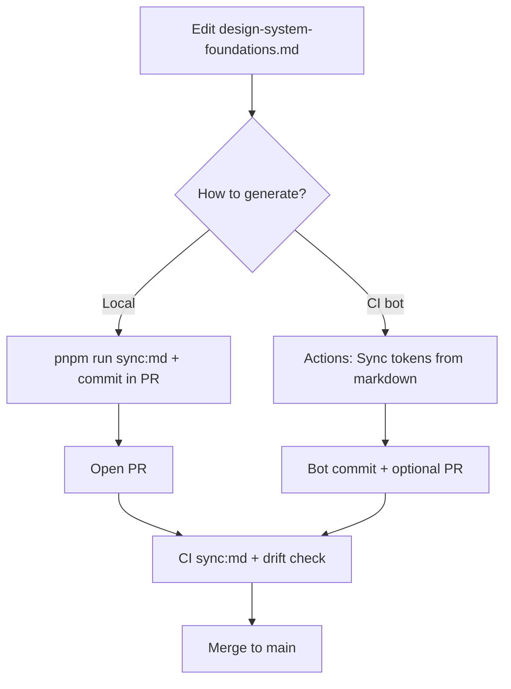

# Workflow & production guide

> **Historical.** The current source of truth is **[`DESIGN.md`](../DESIGN.md)** (`pnpm run sync`) — see **[spec-ssot.md](spec-ssot.md)**. The `sync:md` (markdown JSON-block) and `figma/tokens.json`-as-SSOT flows described below are **no longer active**; `sync:md` has been removed and `figma/tokens.json` is now a generated output. This page is kept for release/registry mechanics only.

This document describes **how the Oter design token pipeline works end to end** when **`design-system-foundations.md`** was the source of truth. For the (now generated) Figma JSON, see **[spec-ssot.md](spec-ssot.md)**.

There are **two full-generation commands** (do not run both on the same change unless you intend to reconcile sources):

| Command | Source | GitHub workflow |
|---------|--------|-----------------|
| `pnpm run sync:md` | `design-system-foundations.md` | **Sync tokens from markdown** (manual only) |
| `pnpm run sync:figma` | `figma/tokens.json` | **Sync tokens from Figma JSON** |

**Related docs**

| Document | Purpose |
|----------|---------|
| [README](../README.md) | Quick start, install, platform snippets |
| [general-next-steps.md](general-next-steps.md) | Cross-platform adoption roadmap |
| [android-material3-next-steps.md](android-material3-next-steps.md) | Material 3 mapping for Android / Compose |

---

## 1. Architecture overview

There is **one human-edited source** and **three generated artifact families**:

```
design-system-foundations.md     ← SOURCE (design + design ops edit this)
         │
         │  pnpm run parse  (md-to-tokens.mjs)
         ▼
    tokens/**/*.json             ← REPO tokens (DTCG JSON, committed)
         │
         ├─────────────────────────────┐
         │  pnpm run figma             │  pnpm run build  (Style Dictionary)
         ▼                             ▼
dist/figma/tokens.json          dist/web, android, ios, …
(Figma / Tokens Studio)         (app codebases)
```

| Artifact | Path | Consumers |
|----------|------|-----------|
| Foundations doc | `design-system-foundations.md` | Designers, design ops, engineers (authoring) |
| Token JSON | `tokens/**/*.json` | This repo, Style Dictionary, custom tooling |
| Figma export | `dist/figma/tokens.json` | Figma Variables via [Tokens Studio](https://tokens.studio/) |
| Platform dist | `dist/web`, `dist/android`, … | Web, Android, iOS, Flutter, Compose apps |
| Version | `**Version:**` in markdown → `package.json` | npm, Maven, release notes |

**Production rule:** never treat `tokens/` or `dist/` as the source of truth for values that exist in the markdown. Edit the foundations doc, run `pnpm run sync:md`, commit the generated tree, merge, then publish registries when consumers need a new version.

---

## 2. Prerequisites (one-time setup)

### 2.1 Local machine

| Requirement | Version | Notes |
|-------------|---------|--------|
| Node.js | **≥ 18.12** | Required by `pnpm` and `package.json` `engines` |
| pnpm | **10.x** (see `packageManager` in `package.json`) | Use `corepack enable` or install pnpm globally |
| Git | any recent | For branch / PR workflow |
| Java + Gradle | 17+ | Only if you build/publish the Android AAR locally |

```bash
cd /path/to/design-system
corepack enable          # optional: use the pnpm version pinned in package.json
pnpm install --frozen-lockfile
pnpm run sync:md         # verify the markdown pipeline runs
```

CI uses **Node 20** for sync/CI and **Node 22.14** for npm publish (trusted publishing requirement).

### 2.2 GitHub repository settings

Configure once per org/repo:

1. **Settings → Actions → General → Workflow permissions**
   - Select **Read and write permissions**
   - Allow GitHub Actions to create and approve pull requests (needed for **Sync tokens from markdown**)

2. **Branch protection on `main`** (recommended)
   - Require PR reviews
   - Require status check **CI** (or your job name) to pass
   - Do not allow bypassing failed checks for token changes

3. **Secrets**
   - **Sync / CI / Android publish:** use built-in `GITHUB_TOKEN` (no extra secret for sync bot commits)
   - **npm publish:** **no `NPM_TOKEN`** — uses [Trusted Publishing](https://docs.npmjs.com/trusted-publishers/) (OIDC)
   - **Android consumers:** apps need `gpr.user` / `gpr.key` (PAT with `read:packages`) — see [§ 7](#7-consuming-tokens-in-production)

---

## 3. Pipeline commands

| Script | What it runs | Output |
|--------|----------------|--------|
| `pnpm run parse` | `md-to-tokens.mjs` | `tokens/`, `figma/tokens.json`, `package.json` ← `design-tokens.json` + `**Version:**` in foundations md |
| `pnpm run figma` | `tokens-to-figma.mjs` | `dist/figma/tokens.json` |
| `pnpm run build` | `sd.config.mjs` (Style Dictionary) | `dist/web`, `dist/android`, `dist/ios`, … |
| `pnpm run sync:md` | parse (md) → figma export → build | All of the above |
| `pnpm run sync:figma` | figma → tokens → build | See [spec-ssot.md](spec-ssot.md) |
| `pnpm run clean` | removes `tokens/` and `dist/` | Use before a full regen from scratch |

### 3.1 Stage 1 — Markdown → `tokens/`

- **Input:** `design-system-foundations.md` (tables + `json` code blocks)
- **Script:** `md-to-tokens.mjs`
- **Behavior:**
  - Reads `**Version:** x.y.z` and writes it to `package.json`
  - Parses every ` ```json ` block and converts legacy `{ "value": … }` to DTCG `$value` / `$type`
  - Writes split files under `tokens/` (e.g. `color/brand.json`, `typography/scale.json`)
  - Removes obsolete files from older scales (`color/primary.json`, etc.)

### 3.2 Stage 2 — `tokens/` → Figma JSON

- **Input:** `tokens/**/*.json`
- **Script:** `tokens-to-figma.mjs`
- **Output:** `dist/figma/tokens.json`
- **Format:** Tokens Studio / Figma Variables import:
  - Top-level collection: `Global/Mode 1` (override with env `FIGMA_COLLECTION="My Set"`)
  - Flat names aligned with CSS: `primary-color`, `spacing-md`, `type-h1`, …
  - Each token includes `com.figma.scopes` and `com.figma.hiddenFromPublishing`
  - Auth gradient split into `auth-gradient-color-1` / `auth-gradient-color-2`
- **npm export:** `@estebanruano/design-tokens/figma` → same file after publish

### 3.3 Stage 3 — `tokens/` → platform `dist/`

- **Script:** `sd.config.mjs` (Style Dictionary v5)
- **Outputs:**

| Platform | Path |
|----------|------|
| Web CSS | `dist/web/tokens.css` |
| Web JS | `dist/web/tokens.js` |
| Android XML | `dist/android/colors.xml`, `dimens.xml` (incl. font sizes), `integers.xml`, `strings.xml` |
| iOS | `dist/ios/DesignTokens.swift` |
| Flutter | `dist/flutter/design_tokens.dart` |
| Compose | `dist/compose/DesignTokens.kt` |
| Debug JSON | `dist/json/tokens.json` (flat, not the Figma format) |

---

## 4. Roles & day-to-day workflows

### 4.1 Designers / design ops

**Goal:** change token values or add tokens documented in the foundations file; keep Figma aligned.

1. Edit **`design-system-foundations.md`** on a branch (or via PR from GitHub UI).
   - Update tables and the `json` blocks in **§ Implementation** sections so they stay in sync.
   - For a **registry release**, bump `**Version:**`** at the top (semver).
2. Push the branch.
3. Run **`pnpm run sync:md`** locally and commit `tokens/`, `figma/tokens.json`, `dist/`, and `package.json` — or trigger **Sync tokens from markdown** manually in Actions (see [§ 5](#5-github-actions-in-production)).
4. Review generated diffs in your PR.
5. **Figma:** after merge, import or sync `dist/figma/tokens.json` in Tokens Studio (see [§ 6](#6-figma--tokens-studio-in-production)).
6. Ask engineering to **publish** npm/Maven only when product apps should pin a new version.

**Do not** hand-edit `tokens/` for values that belong in the markdown unless you are fixing tooling and will reconcile in the same PR.

### 4.2 Engineers (token repo)

**Goal:** ship consistent generated artifacts and green CI.

1. Pull latest `main`.
2. After any foundations change: `pnpm run sync:md`.
3. Commit **`tokens/`**, **`dist/`**, and **`package.json`** when they change.
4. Open PR → wait for **CI** (regenerates and fails on drift).
5. Merge to `main`.
6. Coordinate **publish** workflows when consumers need the new version.

**Adding a token (correct path)**

1. Add the token to the **`figma-tokens`** JSON block in `design-system-foundations.md` (same flat names as Figma) and update the tables for documentation.
2. Run `pnpm run sync:md`.
3. Verify `dist/figma/tokens.json` and platform outputs include the new name.
4. PR + merge.

### 4.3 Release manager (production registries)

**Goal:** publish immutable versions to npm and GitHub Packages Maven.

Publishing is **manual** — merging to `main` does **not** auto-publish.

1. Ensure `**Version:**`** in the foundations doc is bumped (semver) and merged to `main`.
2. Confirm sync artifacts on `main` match that version (`package.json`, `tokens/`, `dist/`).
3. Run workflows from **`main`**:
   - **Publish web tokens (npm)**
   - **Publish Android library** (if Android consumers need the AAR)
4. Announce the version to app teams; they bump dependencies separately.

See [§ 8](#8-release-checklist-production).

---

## 5. GitHub Actions in production

| Workflow file | Name in UI | Trigger | Purpose |
|---------------|------------|---------|---------|
| `sync-tokens-from-md.yml` | Sync tokens from markdown | **Manual only** (`workflow_dispatch`) | `pnpm run sync:md` |
| `sync-tokens-from-figma.yml` | Sync tokens from Figma JSON | Push / manual on `figma/tokens.json` | `pnpm run sync:figma` |
| `ci.yml` | CI | PR to `main` | `sync:figma` if head is `figma-ssot`, else `sync:md` |
| `publish-web.yml` | Publish web tokens (npm) | Manual (`version`, `source`) | set version → `sync:figma` or `sync:md` → `npm publish` |
| `publish-android.yml` | Publish Android library | Manual (`version`, `source`) | set version → `sync:figma` or `sync:md` → Gradle publish |

### 5.1 Markdown sync (manual — no push trigger)

The markdown workflow does **not** run on `push` (unlike the Figma workflow). That avoids circular or duplicate runs when generated files are committed in the same change set or when a bot push would otherwise re-enter the pipeline.

**Typical flow:** edit `design-system-foundations.md` → run `pnpm run sync:md` locally → commit outputs in the same PR → **CI** validates drift on the PR.

**Optional:** in GitHub → **Actions** → **Sync tokens from markdown** → **Run workflow** (pick branch). The bot commits generated files and may open a PR on feature branches.



### 5.2 CI on pull requests

On every PR to `main`:

1. Checkout
2. `pnpm install --frozen-lockfile`
3. `pnpm run sync:md` (or `sync:figma` on `figma-ssot`)
4. `git diff` must be empty (staged vs commit)
5. `./gradlew :design-tokens-android:assembleRelease`

If CI fails with “run sync locally”, run `pnpm run sync:md` (or `sync:figma` on `figma-ssot`) and commit `tokens/`, `dist/`, `figma/tokens.json` (if applicable), and `package.json`.

### 5.3 Publish workflows

Both publish workflows require a **`version`** input (semver) when you click **Run workflow**. They:

1. Run **`set-release-version.mjs`** → `**Version:**` in `design-system-foundations.md` and `package.json` (does not change `figma/tokens.json` `$metadata`)
2. Run **`sync:figma`** or **`sync:md`** per the workflow **`source`** input (default **`figma`**) → `package.json` + `tokens/` + `dist/`
3. Verify `package.json` matches the input version, then publish

**npm (`publish-web.yml`)**

- Node **22.14**, npm **≥ 11.5.1**
- `id-token: write` for OIDC
- Publishes `files` from `package.json`: `dist/web`, `dist/json`, `dist/figma`
- **Trusted Publisher** on npm must match repository + workflow file `publish-web.yml`

**Android (`publish-android.yml`)**

- Publishes `design-tokens-android` to **GitHub Packages** Maven
- **`source=figma`:** `sync:figma` → `dist/android/*.xml` → Gradle AAR (does not use markdown)
- **`source=md`:** `sync:md` from `design-tokens.json` → updates `figma/tokens.json` + `dist/android/*.xml` → Gradle AAR
- Uses the workflow **version** input (via sync → `package.json` → `-PtokensVersion`)
- **409 Conflict** = version already published → run again with a higher **version** input

**Note:** Version bumps in Actions apply only on the runner unless you commit them separately. To persist the version on the branch, run `pnpm run version:set` locally, sync, and commit before or after publish.

---

## 6. Figma / Tokens Studio in production

### 6.1 File to import

After `pnpm run sync:md` (or download from `main` / npm):

**`dist/figma/tokens.json`**

Or from npm after publish:

```bash
# path inside installed package
node_modules/@estebanruano/design-tokens/dist/figma/tokens.json
# or
import figmaTokens from '@estebanruano/design-tokens/figma' assert { type: 'json' };
```

### 6.2 Recommended Figma workflow

1. **Design lead** merges a token PR to `main`.
2. Download **`dist/figma/tokens.json`** from the repo (or CI artifact / npm package at that version).
3. In Figma, open **Tokens Studio** → **Import** / sync → select the file.
4. Review the diff in Tokens Studio before applying to Variables.
5. Publish Figma library updates to the team per your design ops process.

**Naming:** Figma variables use flat names (`primary-color`, `text-primary`) to match Oter CSS custom properties, not nested paths like `color.brand.primary`.

**Light / dark:** the foundations doc documents both themes in CSS; the **`figma-tokens`** block reflects the default theme values. Separate Figma modes per theme would require multiple collections in the JSON export.

### 6.3 Custom collection name

```bash
FIGMA_COLLECTION="Oter / Dark" pnpm run figma
```

Commit the result if your team standardizes on a non-default collection name.

---

## 7. Consuming tokens in production

### 7.1 Web (npm)

**Package:** `@estebanruano/design-tokens`

```bash
pnpm add @estebanruano/design-tokens@1.4.2   # pin exact version in prod
```

```ts
import '@estebanruano/design-tokens/css';

.my-button {
  background: var(--color-brand-primary);
  padding: var(--spacing-md);
}
```

**Exports:**

| Import | Resolves to |
|--------|-------------|
| `@estebanruano/design-tokens` | `dist/web/tokens.js` |
| `@estebanruano/design-tokens/css` | `dist/web/tokens.css` |
| `@estebanruano/design-tokens/json` | `dist/json/tokens.json` |
| `@estebanruano/design-tokens/figma` | `dist/figma/tokens.json` |

Pin versions in `package.json`; use Renovate/Dependabot for updates. Treat **major** bumps as breaking (renamed CSS variables / JS exports).

### 7.2 Android (GitHub Packages Maven)

```kotlin
dependencies {
    implementation("com.estebanruano:tokens-android:1.4.2")
}
```

Repository URL and credentials: see [README § Android apps](../README.md#automation-github-actions).

Resource names come from `dist/android/*.xml` (e.g. `color_brand_primary` after sync — **always verify** `name=` in generated XML when renaming tokens).

### 7.3 iOS / Flutter / Compose

Vendor or copy from `dist/ios`, `dist/flutter`, `dist/compose` at a tagged release, or generate in consumer CI from this repo. See [general-next-steps.md](general-next-steps.md) § 4.

### 7.4 Monorepo / file dependency (pre-release)

```bash
pnpm add "file:../design-system"
```

Run `pnpm run sync:md` (or `sync:figma` on `figma-ssot`) in the design-system repo before consuming apps build.

---

## 8. Release checklist (production)

Use this when shipping a version consumers will install.

- [ ] **Token changes** merged to `main` via PR with green CI
- [ ] **`**Version:**`** bumped in `design-system-foundations.md` (semver: major = breaking rename/removal, minor = new tokens, patch = value-only)
- [ ] `sync:md` or `sync:figma` on `main` (or trust publish workflow to sync)
- [ ] `package.json` version matches markdown
- [ ] **Figma:** design ops imported `dist/figma/tokens.json` for this version (if visual parity required)
- [ ] **Publish web tokens (npm)** from `main` → verify on [npmjs.com](https://www.npmjs.com/package/@estebanruano/design-tokens)
- [ ] **Publish Android library** from `main` (if needed) → verify package on GitHub Packages
- [ ] **Consumer PRs:** bump `@estebanruano/design-tokens` / Maven coordinate in each app
- [ ] **Release notes:** list renamed variables and breaking theme changes

**Duplicate version errors (409):** the version already exists on npm or Maven. Bump `**Version:**`**, merge sync commit, re-run publish.

---

## 9. Versioning model

| Source | Field | Example |
|--------|-------|---------|
| Authoritative | `**Version:**` in `design-system-foundations.md` | `1.4.2` |
| Generated | `package.json` `version` | copied by `pnpm run parse` / `sync` |
| Android publish | Maven version | same as `package.json` unless `-PtokensVersion` set |
| npm publish | package version | same as `package.json` |

All platforms should reference the **same semver** for a given release unless you intentionally diverge (not recommended).

---

## 10. Troubleshooting

| Symptom | Likely cause | Fix |
|---------|----------------|-----|
| CI fails: “run sync locally” | `tokens/` or `dist/` out of date | `pnpm run sync:md` or `sync:figma`, commit results |
| `pnpm` errors on Node 16 | Engine too old | Use Node ≥ 18.12 (CI uses 20) |
| Style Dictionary fails on Node 16 | `style-dictionary` v5 needs newer Node | Use Node 18+ locally |
| npm publish ENEEDAUTH | Trusted Publisher mismatch | Match repo + `publish-web.yml` on npm; check `repository.url` in `package.json` |
| Maven 409 | Version already published | Bump `**Version:**` in markdown |
| Figma import missing tokens | Forgot export step or old commit | Run full `pnpm run sync:md`; import latest `dist/figma/tokens.json` |
| Stale colors in apps | Consumers not bumped | Pin new npm/Maven version in apps |
| Bot did not open PR | Already an open PR for branch | Push again after merging, or run sync locally |
| Sync bot cannot push | Workflow permissions | Enable read/write for Actions |

---

## 11. Environment reference

| Environment | Node | Command | Commits generated files? |
|-------------|------|---------|---------------------------|
| Local dev | ≥ 18.12 | `sync:md` or `sync:figma` | You commit manually |
| CI / PR | 20 | branch-based sync | Fails if drift |
| Sync workflows | 20 | `sync:md` or `sync:figma` | Bot commits + pushes |
| npm publish | 22.14 | `source` input + `npm publish` | Uses commit on selected branch |

---

## 12. What is *not* automated (by design)

- **npm** and **Maven** publish on merge — you run workflows manually when ready.
- **Figma** does not pull from GitHub automatically — design ops imports `dist/figma/tokens.json` (or uses Tokens Studio sync if you configure it to point at a URL/repo path).
- **Consumer apps** do not auto-update — each repo bumps its dependency version.

This keeps production releases deliberate and traceable to a semver on `main`.

---

*Last updated: May 2026 · markdown path: `sync:md` · Figma path: `sync:figma` (see [spec-ssot.md](spec-ssot.md))*
